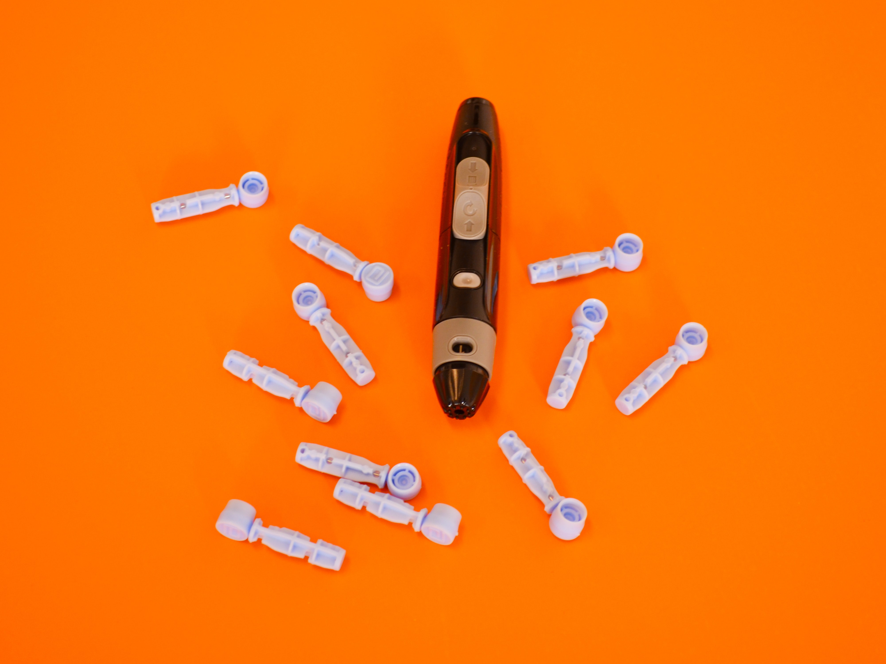

# Diabetic Clustering Project
-Clustering Project: Drivers of time in hospital for diabetic patients.

- Data Science Team Members: Gabby Broussard

## Project Summary:
- I have been asked to analyze data obtained from hospital admissions for diabetic patients between 1999 and 2008 in order to discover the drivers of the length of time spent in the hospital.

Data Source: https://archive.ics.uci.edu/ml/datasets/Diabetes+130-US+hospitals+for+years+1999-2008

## Project Goals:
- Deliver a notebook presentation of models used to isolate drivers of increased length of time spent in the hospital.
- Use clustering methodologies to engineer new features and visualize factors that contribute to length of time spent in the hospital. 
- All files referenced in this presentation are available in the github repository for this project: https://github.com/GabbyBarajasBroussard/diabetic-clustering-project

## Hypotheses:

#### Hypothesis Testing #1 (ANOVA)
$H_0$: There is no difference in length of hospital stay between each race.

$H_a$: There is a significant difference in length of hospital stay based on race.

#### Hypothesis Testing #2 (ANOVA)
$H_0$: There is no difference in length of hospital stay between when changing insulin dose.

$H_a$: There is a significant difference in length of hospital stay when insulin dosage is increased.

#### Hypothesis Test #3 (T-Test)  
$H_0$: patients have the same length of stay in each  cluster.

$H_a$: patients in cluster_demographic have a higher length of stay.

alpha(𝛼): 1 - confidence level (95% confidence level -> 𝛼=.05 )

## Conclusion and Takeaways
- The clusters on insulin were the only clusters selected as best features by Select K Best and RFE.
- This can be evidenced by insulins being listed as top features for predicting hospital stay.
- When fitting this cluster to regression models, the best performing model is the linear regression model performed at 2.918 beating the baseline of 2.939.
- If more time was allotted, I would like to identify what demographic of patients within the insulin clusters had a increased length of stay. I would also like to compare pediatric versus adult length of stays.
- If more resources were alloted, I would like to use medication compliance and if the patient had documented diabetes education prior to admission.

Progression through the Data Science Pipeline:
PLAN -> ACQUIRE -> PREPARE -> EXPLORE -> MODEL -> DELIVER

Each step in my process is recorded and staged on a Trello board at: https://trello.com/b/QJblwzYD

## Plan:

- Create GitHub organization and set up GitHub repo, to include readme.md and .gitignore.
- Brainstorm a list of questions and form hypotheses about how variables might impact one another.
## Acquire:

- Read data from UCI's Machine Learning Repository database into a Pandas dataframe to be analyzed using Python.
- Created a function, acquire(df), as a reproducible component for acquiring necessary data.

## Prepare:

- Carefully reviewed data, identifying any missing, erroneous, or invalid values.
- Explored value counts of the dataframe
- Created and called a function, prepare, as a reproducible component that cleans/prepares data for analysis by: renames columns, handling missing values, adjusts data types, handles any data integrity
- Split the data into train, validate and test sets.
## Explore:

- Visualized all combination of variables to explore relationships.
- Tested for independent variables that correlate with correlate with time in hospital.
- Developed hypotheses and ran statistical tests to accept or reject null hypotheses.
- Summarized takeaways and conclusions.
- Scaled data using MinMax scaler.
- Used clustering methodologies to create new features to model on.
- Ran additional statistical tests on clustered data.
## Model:

- Developed a baseline model.
- Modeled train and validate data on OLS, Lasso Lars, and GLM Regression Models.
- Modeled test on Linear Regression.
Deliver:

- Clearly document all code in a reproducible Jupyter notebook called Walkthrough.
Instructions for Reproducing My Findings:
- Start by cloning the github repository on your From your terminal command line, type git@github.com:GabbyBarajasBroussard/diabetic-clustering-project.git

Download the following files from https://github.com/GabbyBarajasBroussard/diabetic-clustering-project to your working directory:

acquire.py
prepare.py

Data obtained from: https://archive.ics.uci.edu/ml/datasets/Diabetes+130-US+hospitals+for+years+1999-2008
Photo by <a href="https://unsplash.com/@diabetesmagazijn?utm_source=unsplash&utm_medium=referral&utm_content=creditCopyText">Diabetesmagazijn.nl</a> on <a href="https://unsplash.com/s/photos/diabetes?utm_source=unsplash&utm_medium=referral&utm_content=creditCopyText">Unsplash</a>
  
